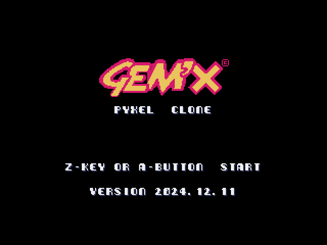

# Gemx
Amiga's Puzzle Game Clone  

## 更新履歴  
2024.12.12 ver.  
作成中につき、多少のバグあり、クリアできない面も存在します。  

## 説明
オリジナルは怪しさ満点のゲームですが、ここではパズルゲームのみ遊べます。  
オリジナルの音楽はTurricanシリーズでお馴染みのChris Hülsbeck。  
この人のCDは数枚持ってまして、Gem'xの音楽も入っています。  
残念ながら本ゲームには音楽は入ってません・・・  

Pyxelマルチカラー対応！  
  
遊び方は左側の宝石を選択して変化させて右側と同じ形にするとクリア。  
Aボタンで宝石を選択すると２段階変化、上下左右の周囲が１段階変化。  
変化順番は画面中央の通り、赤→緑→青→紫→黄→消滅、となります。  
BボタンでUNDOできます。  
  
中央のパラメータは上から  
- 移動数（UNDOも１回となります、移動数オーバーで１ステージスキップ）
- スキップ数（右の「SKIP STAGE」選択すると次のステージに行けます。スキップ数オーバーでゲームオーバー）
- 次のmineに行くために必要なステージクリア数
- ステージクリアに要する時間、０になったらステージスキップ。

操作はキーボード、ゲームパッド（アナログスティック対応）  
  

## GIFアニメ

